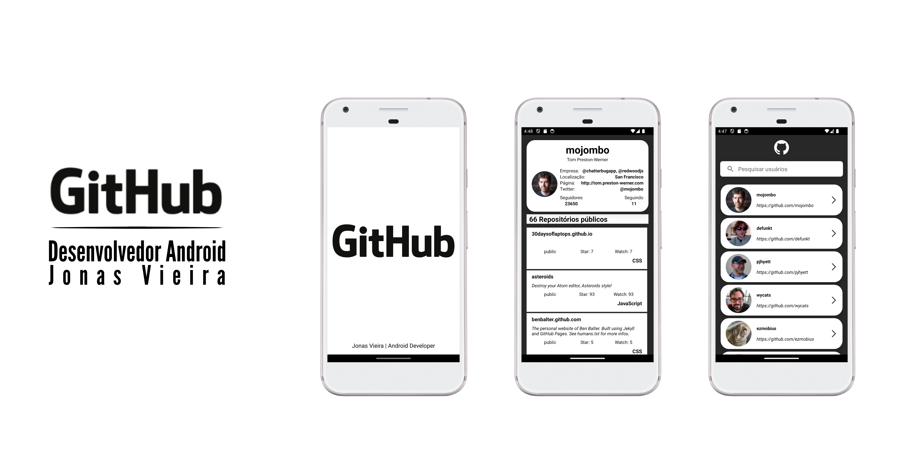
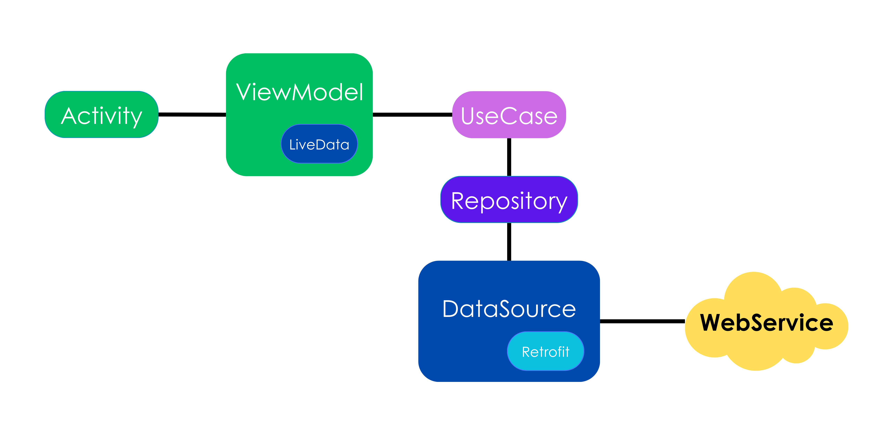
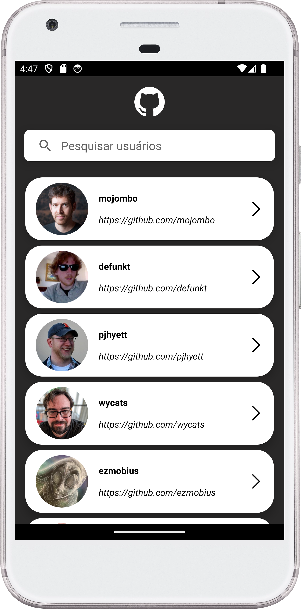
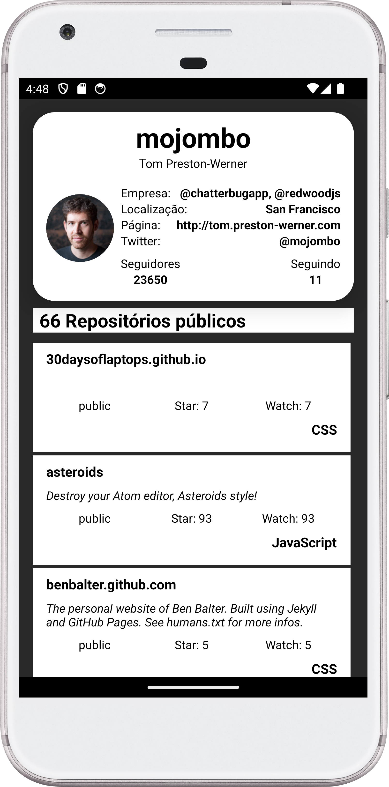

# GithubAPI

Projeto criado para implementação de uma aplicação Android que deverá consumir a API pública do Github, que disponibiliza informações sobre os usuários e seus repositórios, onde o aplicativo deverá permitir a listagem de usuários, busca de usuário por nome de usuário e visualização das informações de um usuário específico, bem como a listagem de seus repositórios. 


## Arquitetura
Model-View-ViewModel (MVVM)


## Stack utilizada

- **Dagger Hilt**
- **Coroutines**
- **Retrofit**
- **Databinding**
- **MockK**
- **Picasso**


## Screenshots

&nbsp;&nbsp;&nbsp;&nbsp;&nbsp;&nbsp;

## Rodando os testes

Para rodar os testes, rode o seguinte comando 

```bash
  ./gradlew test
```
